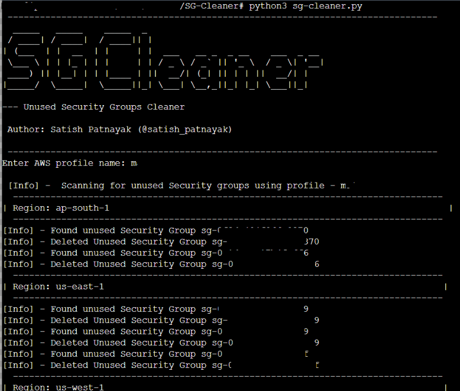

# SG Cleaner - Unused Security Group Cleaner
SG-Cleaner is a simple and powerful Python script designed to streamline your AWS security group management. It identifies and safely removes unused security groups, helping you maintain a tidy and secure AWS environment.

## Why Remove Unused Security Groups?

In AWS, security groups act as virtual firewalls for your instances. When a security group is no longer associated with any instances, it becomes an unused security group. These unused security groups can clutter your AWS environment and make it harder to manage your security configurations effectively. This script helps you identify and remove these unused security groups.
Cloud Security Posture Management (CSPM) tools like Prowler or ScoutSuite can flag unused security groups as vulnerabilities. While these security groups may not pose an immediate threat, they can indicate areas where your security posture can be improved.  <br>SG-Cleaner helps you maintain a clean and efficient security posture by automatically detecting and removing these unnecessary groups.


## Prerequisites
- Python 3.x installed on your system.
- Boto3 library installed. You can install it using the following command:<br>
 ``` pip3 install boto3```
- AWS profile configured

## Configuration

You can customize the list of AWS regions to scan by updating the `regions` list in the script (`sg-cleaner.py`).

## Exception List

You can specify a list of security groups that should be excluded from deletion. Edit the `exception_list` variable in the Python script to add the IDs of the security groups you want to protect.

```python
E.g.
exception_list = ['sg-12345678', 'sg-87654321']
```

## Usage

1. Configure the AWS regions in `sg-cleaner.py`
2. Update the `exception_list` or leave it blank
2. Run the script 
3. Provide your AWS profile name when prompted.
4. The script will scan the specified AWS regions for unused security groups.
5. Any unused security groups found will be deleted.

## How to Run

```bash
python3 sg-cleaner.py
```
## Sample output


## Note
Please be cautious when running this script, as it deletes security groups.
## Contributing
Contributions are welcome! Please open an issue or submit a pull request.

## Disclaimer
This script is provided for educational and security assessment purposes only. Use it at your own risk and only on systems that you have explicit permission to scan. The author is not responsible for any unauthorized or illegal use of this script.

## Author
Name: Satish Patnayak </br>
X (Twitter): <a href="https://twitter.com/satish_patnayak">@satish_patnayak</a>
